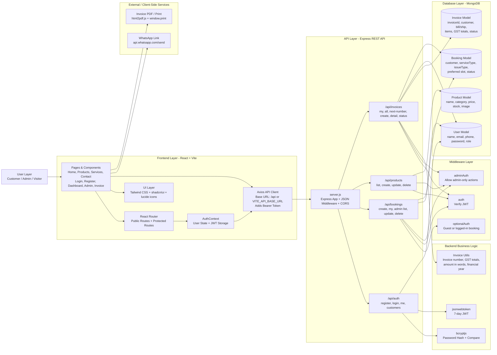
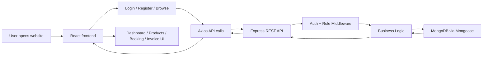

# Renuka Enterprises - System Architecture

## Project Overview

Renuka Enterprises is a full-stack service management web application for Aquaguard, inverter, battery, product, booking, and invoice management.

It has two main user roles:

- Customer: register/login, book services, view booking history, reschedule/cancel eligible bookings, view invoices.
- Admin: manage bookings, products, customers, invoices, and invoice payment status.

## Tech Stack

Frontend:

- React 18
- TypeScript
- Vite
- React Router
- Axios
- TanStack React Query
- Tailwind CSS
- shadcn/ui
- lucide-react icons

Backend:

- Node.js
- Express.js
- MongoDB
- Mongoose
- JWT authentication
- bcryptjs password hashing
- CORS
- dotenv

Database:

- MongoDB collections through Mongoose models:
  - users
  - bookings
  - products
  - invoices

## Architecture Diagram

## Main Application Flow

1. Visitor opens the React frontend.
2. React Router loads public pages such as Home, Services, Products, Contact, Login, and Register.
3. If the visitor logs in or registers, the frontend sends credentials to `/api/auth`.
4. Backend validates the request, hashes/checks password using bcryptjs, and returns a JWT.
5. Frontend stores the JWT in `localStorage`.
6. Axios automatically attaches the JWT as `Authorization: Bearer <token>` for future API calls.
7. Protected frontend pages check the current user through `AuthContext` and `ProtectedRoute`.
8. Backend middleware validates JWT and role before allowing protected actions.
9. Data is stored and retrieved from MongoDB through Mongoose models.

## Customer Flow

1. Customer registers or logs in.
2. Customer opens dashboard or booking page.
3. Customer creates a service booking.
4. Booking is saved in MongoDB with status `pending`.
5. Customer can view their bookings through `/api/bookings/my`.
6. Customer can cancel or reschedule bookings while status is `pending` or `in-progress`.
7. Customer can view invoices assigned to them through `/api/invoices/my`.

## Admin Flow

1. Admin logs in through admin portal.
2. Backend checks `expectedRole: admin`.
3. Admin dashboard loads:
   - all bookings
   - all products
   - all invoices
   - all customers
4. Admin can:
   - update booking status
   - delete bookings
   - create/update/delete products
   - generate invoices
   - mark invoices as generated or paid

## API Connectivity

Frontend API client:

- File: `src/services/apiClient.js`
- Base URL:
  - `VITE_API_BASE_URL` if configured
  - otherwise `/api`
- In development, Vite proxies `/api` to `http://localhost:5000`.

Backend API server:

- File: `backend/server.js`
- Default port: `5000`
- Routes:
  - `/api/auth`
  - `/api/bookings`
  - `/api/products`
  - `/api/invoices`
  - `/api/health`

## Important Endpoints

Authentication:

- `POST /api/auth/register`
- `POST /api/auth/login`
- `GET /api/auth/me`
- `GET /api/auth/customers` admin only

Bookings:

- `POST /api/bookings`
- `GET /api/bookings/my`
- `PATCH /api/bookings/:id/customer`
- `GET /api/bookings` admin only
- `PUT /api/bookings/:id` admin only
- `DELETE /api/bookings/:id` admin only

Products:

- `GET /api/products`
- `POST /api/products` admin only
- `PUT /api/products/:id` admin only
- `DELETE /api/products/:id` admin only

Invoices:

- `GET /api/invoices/my`
- `GET /api/invoices` admin only
- `GET /api/invoices/next-number` admin only
- `POST /api/invoices` admin only
- `GET /api/invoices/:id`
- `PATCH /api/invoices/:id/status` admin only

## Security Flow

- Passwords are never stored directly.
- bcryptjs hashes customer/admin passwords.
- JWT is created after successful login/register.
- JWT expires after 7 days.
- Protected API routes use `auth` middleware.
- Admin-only routes use both `auth` and `adminAuth`.
- Frontend protected pages use `ProtectedRoute`.

## Database Models

User:

- name
- email
- phone
- password
- role: customer/admin

Booking:

- customer reference
- name, email, phone
- serviceType: aquaguard/inverter
- issueType
- preferredDate
- preferredTime
- status
- source

Product:

- name
- category
- description
- price
- stock
- image
- isActive

Invoice:

- invoiceId
- serialNumber
- customer reference
- billTo / shipTo
- invoiceDate
- dateOfSupply
- items
- CGST / SGST totals
- totalAmount
- amountInWords
- bankDetails
- status

## System Flow Summary

